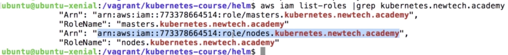
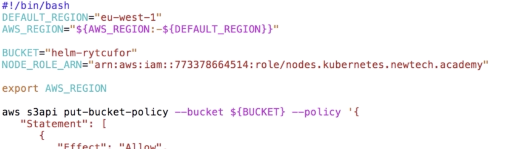

# install jenkins

```
kubectl create -f serviceaccount.yaml
helm install --name jenkins --set rbac.install=true,Master.RunAsUser=1000,Master.FsGroup=1000 stable/jenkins
```

## Add s3 bucket permission for nodes

```bash
# list iam roles
aws iam list-roles | grep kubernetes.newtech.academy
```



copy ARN and put it in NODE_ROLE_ARN in `put-bucket-policy.sh` file.

```
vim ../put-bucket-policy.sh
```


