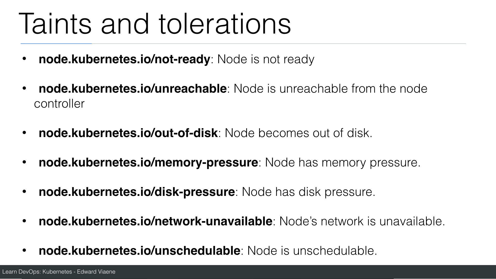

# Taint and Tolerations

# Taint a node

```
kubectl taint nodes NODE-NAME type=specialnode:NoSchedule
```

# Taint a node with NoExecute

```
kubectl taint nodes NODE-NAME testkey=testvalue:NoExecute
```



